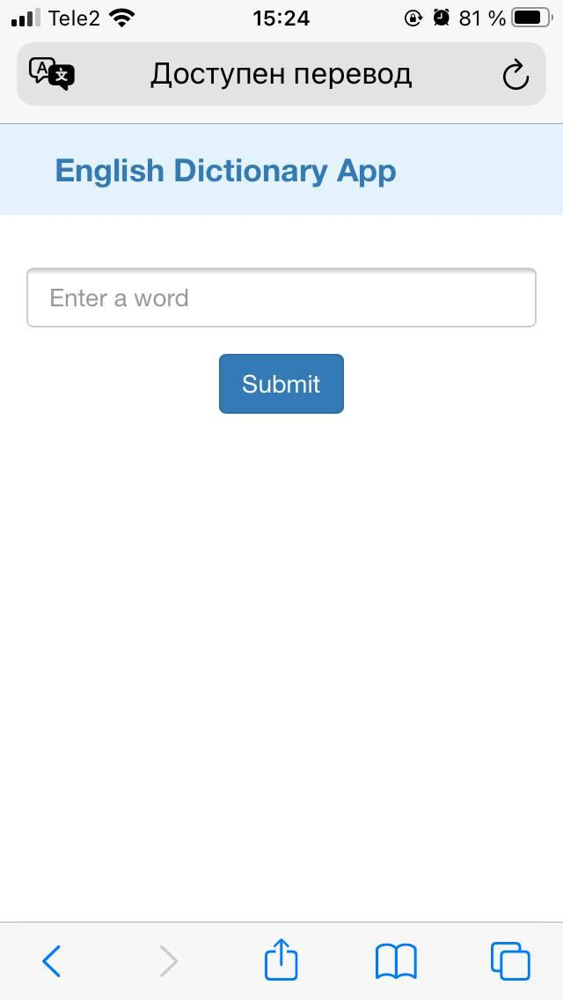
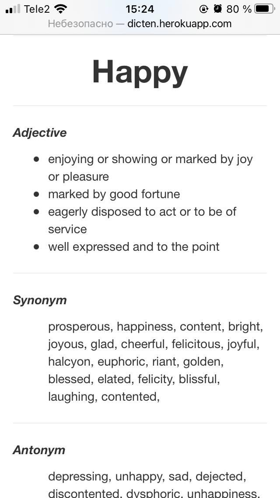

# dictionary_app

**About:** The English dictionary application by Flask

**Description:** The English dictionary is made with the help of Flask and the packet "PyDictionary"

  

<b>The main page</b>

  

<b>The results of the find</b>

